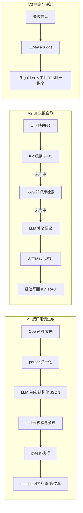

# AI 智能测试辅助引擎（AI-TAE）

> 状态：**骨架阶段 v0.1**（目录与接口契约已建，业务代码未开始）
> 给 AI 助手的协作指引见 [AGENTS.md](AGENTS.md) ｜ 阶段进度见 [docs/progress-2026-09-03.md](docs/progress-2026-09-03.md)
> 项目说明书与上下文交接：`AI-TAE-项目说明书与上下文交接.md` ｜ V1 技术方案：[docs/v1-technical-design.md](docs/v1-technical-design.md)

把 LLM 嵌入真实测试工作流的引擎，分三步落地：

- **V1** 接口文档（OpenAPI/Swagger）→ 自动生成可执行 pytest 用例 → 统计可执行率/通过率
- **V2** UI 用例失败自愈：先查本地 KV 缓存 → 未命中查 RAG 知识库 → 仍无解才问 LLM → 人工确认后应用
- **V3** LLM-as-Judge 区分「真 Bug / Flaky / 用例问题」，用 golden 人工标注评测一致率

> ⚠️ **真实数字纪律**：本仓库一切指标以【待实测】占位。未实测前不填任何数字，拒绝编造/包装。

## 系统架构（规划）



技术栈：Python 3.12 + FastAPI(被测) / pytest + requests / OpenAI 兼容接口 / diskcache + ChromaDB + SQLite（V2 起）/ Docker 沙箱（V2 起）。刻意不引 LangChain——手写 pipeline，每一环可讲清。

## 环境（Windows 已迁移到 C 盘独立环境）

> 背景：原开发环境装在 D 盘，D 盘现为只读保护，故在 C 盘重建，与 D 盘完全解耦。

- 独立 Python：`C:\Users\彭井艺\AppData\Local\Programs\Python\python312\python.exe`（官方 Python 3.12 二进制，纯解压安装，不依赖注册表）
- 项目虚拟环境：本目录 `.venv`（已 gitignore），pyvenv.cfg 的 home 指向上述 C 盘 Python
- 后续若想更「标准」，可在 D 盘修复后用 python.org 安装器正常注册 py / PATH；当前用法见下。

## 快速开始（Windows PowerShell）

```powershell
cd C:\Users\彭井艺\Desktop\秋招项目\项目作品\04-AI智能测试辅助引擎-AITAE
.\.venv\Scripts\Activate.ps1
python -m pip install -r requirements-dev.txt
python -m pip install -e .
aiae selfcheck
python -m pytest -q
```

> 依赖清单约定：requirements.txt = 运行时；requirements-dev.txt = 运行时 + 测试；V2 再引入 requirements-v2.txt（diskcache/chromadb/playwright）。权威来源是 pyproject.toml。

## 目录结构

```
04-AI智能测试辅助引擎-AITAE/
├── AGENTS.md                   # 给 AI 助手的协作指引（新对话自动读取）
├── docs/
│   ├── progress-2026-09-03.md  # 阶段进度与交接
│   └── v1-technical-design.md  # V1 技术方案（数据流/接口契约/429/指标口径）
├── src/aiae/                   # 主包（src 布局）
│   ├── config.py / cli.py      # 配置 / 命令行入口
│   ├── llm/ parser/ generator/ runner/ metrics/   # V1 模块（契约先行）
│   └── healer/ judge/ kv/ rag/ # V2/V3 占位
├── tests/                      # 自身单元测试
├── samples/                    # 被测项目记录 + 导出 OpenAPI（已选定 todo_app）
├── data/                       # 被测快照与运行产物（gitignore，不入库）
└── pyproject.toml
```

## Roadmap 与当前进度

| 阶段 | 内容 | 状态 |
|---|---|---|
| 任务 1 | 确认被测开源小项目 + 细化 V1 技术方案 + C 盘环境 | ✅ 已完成（被测：manojnd9/todo_app） |
| 任务 2 | V1：OpenAPI → 生成 → Parser → pytest 执行 → 指标 | 未开始（初试后集中做） |
| 任务 3 | V2：自愈 + KV/RAG | 未开始 |
| 任务 4 | V3：judge + golden | 未开始（视时间） |
| 收尾 | 可观测性控制台 + README 截图 + 演示 | 见 docs（V1 之后再加，避免假数据） |

时间盒提醒：考研初试（约 2026-12）前只做轻量工作，大代码留到初试后集中冲刺。

## 证据链清单（做完勾选，全部真实）

- [x] 选定 1 个真实开源小项目（被测对象：todo_app，固定 commit）
- [ ] V1：可执行率 / 通过率【待实测】
- [ ] V2：≥5 个真实 UI 改动 case + 自愈成功率/耗时【待实测】
- [ ] V2：缓存命中率【待实测】
- [ ] V3：judge 与 golden 一致率【待实测】
- [ ] 公网部署 URL / 可运行演示
- [ ] README：架构图 + 截图 + 快速开始（架构图✅，截图待 V1）
- [ ] 演示视频（2–3 分钟）
- [ ] git commit 历史真实连续
- [ ] （可选）开源到 GitHub 收集真实反馈