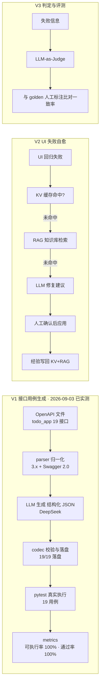
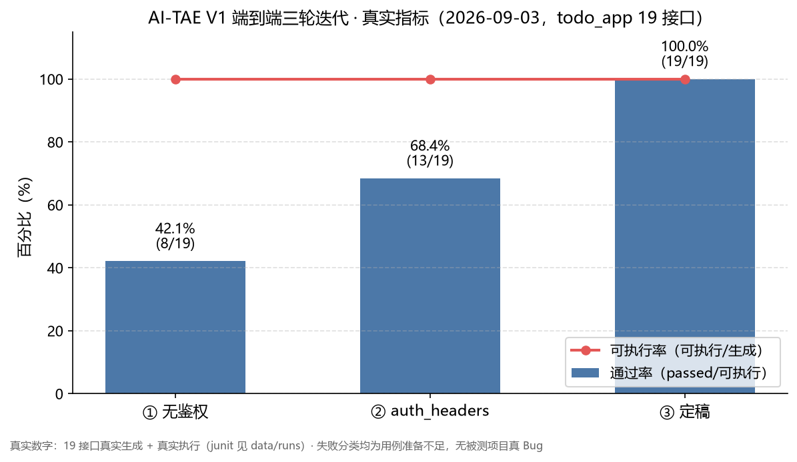
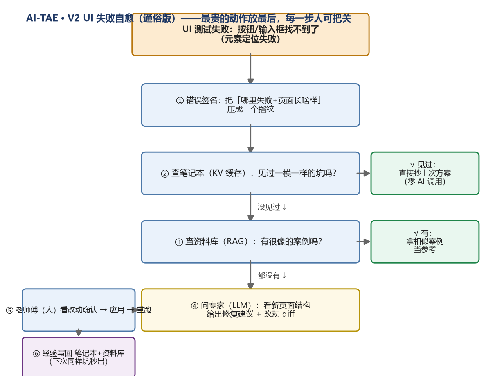
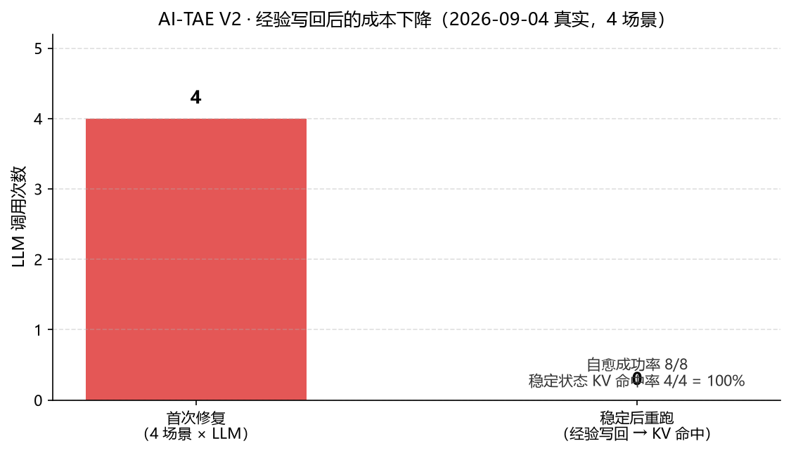

# AI 智能测试辅助引擎（AI-TAE）

> **一句话**：把 LLM 嵌进真实测试工作流的引擎——喂它被测项目的接口说明书，自动产出可执行的
> pytest 用例并跑出真实通过率；被测网页改版导致 UI 测试失效时，自动修复并真实验证。
>
> **解决什么问题**：手写接口/UI 测试是苦力活且容易漏；直接让 AI 写又不保证能跑、不可复现、难回归。
> AI-TAE 把「AI 起草 + 机器门禁 + 人工审阅 + 持续回归」串成一条可复现、可统计、可审计的流水线。
>
> **怎么证明有效**：在 2 个真实开源被测项目上端到端跑通并留 junit 证据——
> V1：todo_app 19/19、fastapi_crud_todo 6/6；V2：4 场景自愈 8/8、稳定态 KV 命中 100%；
> 自身 147 个测试全过。一切数字可复现、可回溯，无编造。

> 阶段进度：[docs/progress-2026-09-04.md](docs/progress-2026-09-04.md)（最新）｜
> [docs/progress-2026-09-03.md](docs/progress-2026-09-03.md)（V1 端到端 + V2）｜
> 协作指引 [AGENTS.md](AGENTS.md)｜技术方案 [docs/v1-technical-design.md](docs/v1-technical-design.md)｜
> 被测项目记录 [samples/README.md](samples/README.md)

## 系统架构（V1 已实测）



技术栈：Python 3.12 + FastAPI(被测) / pytest + requests / OpenAI 兼容接口 / diskcache + ChromaDB + SQLite（V2 起）/ Docker 沙箱（V2 起）。刻意不引 LangChain——手写 pipeline，每一环可讲清。

### V1 实测指标（2026-09-03，真实）

19 个接口（todo_app）由 DeepSeek 真实生成、对被测服务真实执行，三轮迭代至定稿；连跑两次可复现。



- 可执行率 = 19/19 = 100%（codec/ast 门禁：LLM 输出都能被 pytest 收集执行）
- 通过率 = 19/19 = 100%（分母 = 可执行；三次迭代失败分类均为「用例准备不足」，无一为被测项目真 Bug）
- 完整口径与迭代记录见 docs/progress-2026-09-03.md §六；junit 报告在 data/runs（gitignore，不入库）

### V2 实测指标（2026-09-04，真实）

V2（UI 失败自愈）已在 todo_app 上真实跑通最小闭环并扩到 4 场景（不同页面/改法）：
登录页改 name、注册页改 name、注册页改 form id、登录页改按钮文本。





| 场景 | 改法 | 首次修复（LLM） | 稳定后重跑 |
|---|---|---|---|
| S1 login 改 name | `username→user_name` | `input[name='user_name']` | KV 命中 |
| S2 register 改 name | `email→mail` | `input[name='mail']` | KV 命中 |
| S3 register 改 id | `registerForm→signupForm` | `form#signupForm` | KV 命中 |
| S4 login 改文本 | `Login→Sign In` | `button[type='submit']` | KV 命中 |

- 自愈成功率 = 8/8（首次 LLM + 稳定后 KV 重跑全部成功，新定位器均经 Edge 真实页面验证）
- KV 命中率（页面结构稳定时）= 4/4 = 100%，零 LLM 调用（经验写回的价值）
- 真实工程发现：同页连续改版会使「整页结构指纹」变化导致 KV 签名失效 → **RAG 模糊检索兜底**仍成功（KV 精确敏感 / RAG 模糊鲁棒的互补实证）
- 完整口径与记录见 docs/progress-2026-09-03.md；数据产物在 data/v2_experiments（gitignore，不入库）

### 适配层可移植实证（2026-09-04，真实）

核心代码与被测项目通过「适配契约」解耦——**换一个被测项目只需写一个约 30 行适配器，核心零改动**。
已在第二个真实项目（与 todo_app 完全不同：无认证纯 CRUD）上验证：

| 被测项目 | 认证形态 | 接口数 | 真实结果 |
|---|---|---|---|
| todo_app（manojnd9/todo_app，password） | 登录 + token | 19 | 19/19 可执行率/通过率 100%（回归） |
| fastapi_crud_todo（lymanny/FastAPI-CRUD-Todo，none） | 无认证 | 6 | 6/6 可执行率/通过率 100%（方案 B 后，零人工修正） |

生成质量三次迭代（全部真实，同一被测、同一模型、无人工修正）：
① LLM 在用例里自建资源、凭惯例断言 201 → 通过率 66.7%；
② 仅给 Prompt 加「状态码纪律」规则 → 50%（模型看不到子接口的 responses，规则缺信息支撑）；
③ **方案 B**：资源改由框架 fixture 创建注入、LLM 用例不自建 → **100%**。

结论（可讲）：与其让 LLM「少犯错」，不如让 LLM「没有机会犯那类错」——资源准备从 LLM 代码移到框架，
自建子请求这一整类错误消失。完整记录见 docs/progress-2026-09-04.md；junit 在 data/runs（gitignore，不入库）。

## 环境（Windows 已迁移到 C 盘独立环境）

> 背景：原开发环境装在 D 盘，D 盘现为只读保护，故在 C 盘重建，与 D 盘完全解耦。

- 独立 Python：`C:\Users\彭井艺\AppData\Local\Programs\Python\python312\python.exe`（官方 Python 3.12 二进制，纯解压安装，不依赖注册表）
- 项目虚拟环境：本目录 `.venv`（已 gitignore），pyvenv.cfg 的 home 指向上述 C 盘 Python
- 后续若想更「标准」，可在 D 盘修复后用 python.org 安装器正常注册 py / PATH；当前用法见下。

## 快速开始（Windows PowerShell）

```powershell
cd C:\Users\彭井艺\Desktop\秋招项目\项目作品\04-AI智能测试辅助引擎-AITAE
.\.venv\Scripts\Activate.ps1
python -m pip install -r requirements-dev.txt
python -m pip install -e .
aiae selfcheck
python -m pytest -q
```

### 配置 LLM Key（真实生成前）

```powershell
Copy-Item .env.example .env   # 首次复制
notepad .env                  # 填入 AITAE_LLM_API_KEY，并把 AITAE_TARGET_BASE_URL 指向被测服务
```

- `.env` 已被 gitignore，**不会入库**；仓库内所有示例只保留 `sk-你的key` 占位，真实 key 只存在于本地 `.env`。
- 若 key 曾出现在聊天/日志等外部环境，安全做法是去服务商后台**作废重建**一把新 key 再更新 `.env`。

### V1 跑一轮（真实）

```powershell
# 0) 先启动被测项目 todo_app（在 data/targets/todo_app 内，见 samples/README.md），端口与 .env 的 AITAE_TARGET_BASE_URL 一致
# 1) 真实生成（调 DeepSeek，需 .env 已配 key）
aiae generate
# 2) 真实执行并统计指标（可执行率 / 通过率，报数先报口径）
aiae run
```

> 依赖清单约定：requirements.txt = 运行时；requirements-dev.txt = 运行时 + 测试；V2 再引入 requirements-v2.txt（diskcache/chromadb/playwright）。权威来源是 pyproject.toml。

## 目录结构

```
04-AI智能测试辅助引擎-AITAE/
├── AGENTS.md                   # 给 AI 助手的协作指引（新对话自动读取）
├── docs/
│   ├── progress-2026-09-03.md  # 阶段进度与交接
│   └── v1-technical-design.md  # V1 技术方案（数据流/接口契约/429/指标口径）
├── src/aiae/                   # 主包（src 布局）
│   ├── config.py / cli.py      # 配置 / 命令行入口
│   ├── llm/ parser/ generator/ runner/ metrics/   # V1 模块（契约先行）
│   └── healer/ judge/ kv/ rag/ # V2/V3 占位
├── tests/                      # 自身单元测试
├── samples/                    # 被测项目记录 + 导出 OpenAPI（todo_app + fastapi_crud_todo）
├── data/                       # 被测快照与运行产物（gitignore，不入库）
└── pyproject.toml
```

## Roadmap 与当前进度

| 阶段 | 内容 | 状态 |
|---|---|---|
| 骨架 + 契约 | 目录/接口契约/metrics 口径 + C 盘独立环境 | ✅ 已完成 |
| V1 | OpenAPI → LLM 生成 → 门禁落盘 → pytest 执行 → 指标 | ✅ 已完成（todo_app 19/19、fastapi_crud_todo 6/6） |
| 适配层实证 | 第二被测项目 + 方案 B（资源与认证解耦） | ✅ 已完成（2026-09-04，核心零改动换项目） |
| V2 | UI 失败自愈：KV → RAG → LLM → 人工确认 → 验证 → 写回 | ✅ 关键路径已跑通（4 场景自愈 8/8、稳定态 KV 命中 100%） |
| V3 | judge + golden 评测 | ⬜ 占位（初试后集中做） |
| 收尾 | README 门面 / 演示视频 / 可观测性 | 🔄 进行中 |

时间盒提醒：考研初试（约 2026-12）前只做轻量工作，大代码留到初试后集中冲刺。
## 证据链清单（做完勾选，全部真实）

- [x] 选定 2 个真实开源小项目（todo_app / fastapi_crud_todo，均固定 commit）
- [x] V1：可执行率 / 通过率 100%（todo_app 19/19、fastapi_crud_todo 6/6，junit 留档）
- [x] V2：4 个真实 UI 改动场景，自愈成功率 8/8、稳定态 KV 命中 100%
- [x] V2：缓存命中率（稳定态）4/4 = 100%
- [ ] V3：judge 与 golden 一致率【待实测】
- [ ] 公网部署 URL / 可运行演示
- [x] README：架构图 + 实测数字 + 快速开始（mermaid + PNG 图均已引用）
- [ ] 演示视频（2–3 分钟）
- [ ] git commit 历史真实连续
- [ ] （可选）开源到 GitHub 收集真实反馈